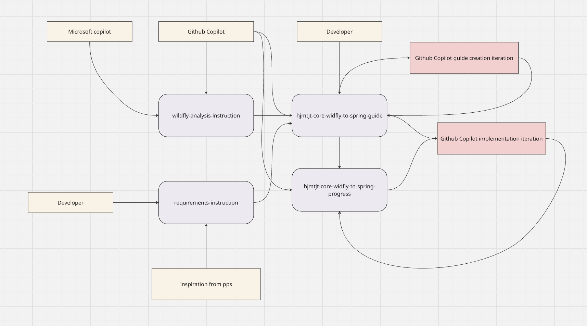

# 🚀 Wildfly to Spring Boot Migration Process Using AI

This document outlines a structured approach to migrating applications from Wildfly to Spring Boot using AI assistance, with a focus on maintaining code quality and enabling iterative development.

---

## ⚠️ Problem Statement

When using AI for migration tasks, several challenges arise:

- Abstract task definitions lead to inconsistent AI-generated results
- AI-generated code often deviates from established standards
- Building context for AI during code generation is slow
- Difficult to clear AI conversation history while maintaining context

---

## 💡 Solution Framework

### Core Methodology

#### 🎯 Context Enhancement for AI

- ✅ Provide specific requirements and design choices to guide AI generation
- ✅ Follow established patterns to ensure consistent AI output
- ✅ Enable greater control over the AI-driven migration process

#### ⚡ Improved AI Interaction Experience

- Store migration status as context for AI continuity
- Faster AI generation and response times through structured inputs
- Ability to clear AI conversations when needed while preserving essential context
- Support for parallel work streams with independent AI sessions

#### ✔️ Quality Control

- Requires human review of AI-generated context and proposed solutions
- May need AI implementation reset if instructions change significantly
- Validates that AI adheres to coding standards and requirements

---

## 📋 Migration Process

### 📝 Document Creation Phase

1. **Develop comprehensive requirements document** - This is the critical foundation document capturing all team thoughts, requirements, and design choices. This should be created by developers first and contains the authoritative requirements for the migration.
2. *(Optional)* Create requirements inspiration document - AI can analyze Spring design patterns and best practices to potentially enhance the requirements document with additional ideas or alternatives.
3. Generate analysis instructions for repository examination
4. Create application-specific migration guide
5. Establish progress tracking document

> **⚠️ Important:** Step 1 is the most critical phase. The requirements document must capture everything the development team has decided regarding the migration approach, architectural choices, and technical requirements. AI can supplement this with inspiration, but the core requirements come from the team.

### 🛠️ Implementation Phase

1. Use AI to perform iterative migration following the guide
2. Update progress document after each AI-assisted iteration
3. Mark areas needing developer attention with "OBSERVE"
4. Manually review and update guides as necessary based on AI implementation findings

---

## 🔁 Iteration Strategy

Migration should proceed in small, manageable increments with frequent updates to the progress document. This approach allows for:

- Thorough examination of each component
- Better management of technical complexity
- Clearer communication about design choices
- Earlier identification of issues requiring developer input

---

## 👨‍💻 Developer Responsibilities

While AI handles the bulk of the migration implementation, developers play a crucial role in ensuring quality and maintaining project integrity:

### 📚 Context Management

- Provide relevant context documents to the AI at the beginning of each session
- Ensure the AI has access to migration guides, requirements, and progress tracking documents
- Update context documents when design decisions or requirements change

### 🔍 Verification and Review

- Review all AI-generated code changes before accepting them
- Verify that AI responses align with established coding standards and requirements
- Test functionality to ensure AI-implemented changes work as expected
- Check that AI adheres to the migration guide and requirements

### 💾 Version Control

- Commit changes in small, logical increments after verification
- Keep the branch up to date with frequent commits to track progress
- Use descriptive commit messages that reflect the specific migration step completed
- Push changes regularly to maintain backup and enable collaboration

### 📖 Guide Maintenance

- Address all "OBSERVE" markers left by the AI
- Update migration and progress documents based on implementation findings
- Document any deviations from the original plan and rationale

---

## ✨ Success Criteria

The migration is considered successful when:

- ✅ Application runs on Spring Boot with equivalent functionality
- ✅ Code adheres to modern Spring standards
- ✅ Technical debt is minimized
- ✅ All developer "OBSERVE" items have been addressed
